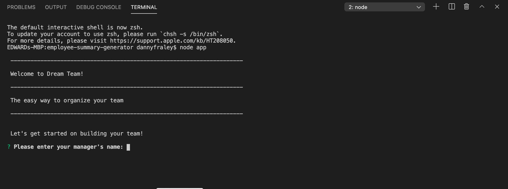
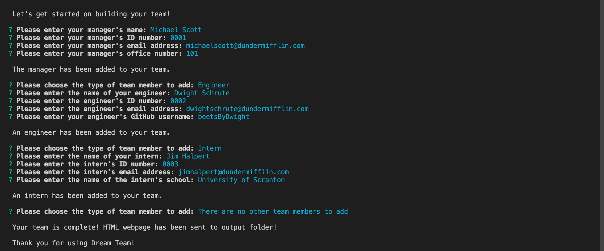
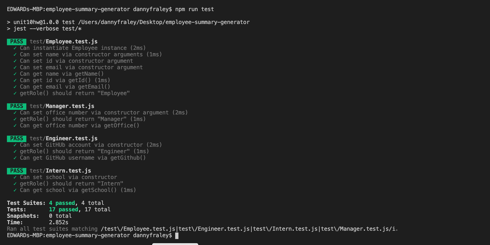

# Employee Summary Generator

A CLI application that generates an HTML file which displays the information each user enters in the form of an employee directory. 

## Table of Contents
* [Installation](#installation)
* [Usage](#usage)
* [License](#license)
* [Contributing](#contributing)
* [Tests](#tests)
* [Questions](#questions)

## Installation
Download the `app.js` and `package.json` files to your local system. Then in the terminal, run the command `npm i` to install the file's required dependencies. After installing the dependencies, run the command `node app` in the terminal. This will start the program, and give the user prompts.

## Usage
The user will be given a series of prompts to answer regarding their employees. The employee types are `Manager`, `Engineer`, and `Intern`. Each employee type has a different series of prompts that provide information about each employee. Once the user has completed entering all of their employees, they are prompted that their team is complete and a new HTML file has been created in a folder called `Output`. Open this file in a web browser to see the employee information website that has been created.

  
  

## License
This application has been created under the MIT License license.

## Contributing
Danny Fraley is currently the sole contributor to this project. If you are interested in contributing, feel free to do so in another branch.

## Tests
All testing for this application has been done through the `Jest` testing application. To run the tests, download the test folder from GitHub and run the command `npm run test` in node.

  

## Questions
For question about using this application, please contact me at one of the links below.
<a href='https://www.github.com/dannyfraley'>Github</a>
<a href='mailto:dannyfraley@gmail.com'>dannyfraley@gmail.com</a>
